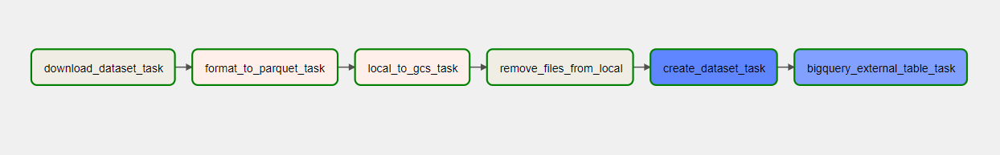
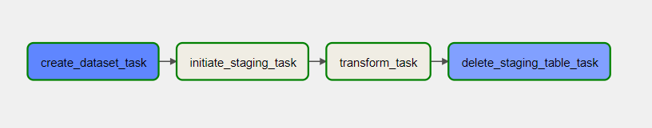
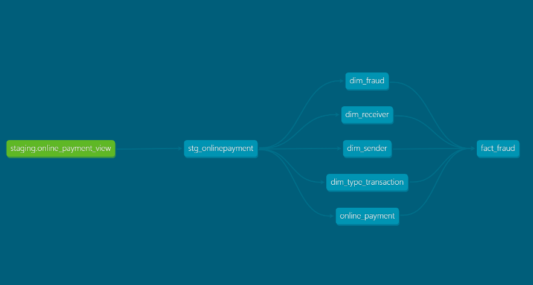

## Setup Airflow on Virtual Machine Instances

We'll set up Airflow on a dedicated compute instance of Docker. dbt is configured within airflow.

- Clone git repo

  ```bash
  git clone https://github.com/fahmihamzah84/OnlinePaymentFraud-LambdaArchitecture.git && \
  cd OnlinePaymentFraud-LambdaArchitecture
  ```

- Move the service account json file from local to the VM machine in `~/.google/credentials/` directory. To prevent the dags from failing, make sure the file is named "google_credentials.json"

- Set the evironment variables on Airflow/.env file

  - GCP Project ID

  - Cloud Storage Bucket Name
  ```bash
    GCP_PROJECT_ID=project-id
    GCP_GCS_BUCKET=bucket-name
    ```
### Start Airflow. 

  ```bash
    bash ~/OnlinePaymentFraud-LambdaArchitecture/startup/airflow.sh && cd ~/.OnlinePaymentFraud-LambdaArchitecture/airflow
   ```

- A few minutes after the above- mentioned setup is finished, airflow should be accessible on port "8080." Use the default login credentials of **airflow**.

- The airflow system will be operating in detached mode. Run the command below to view the logs from Docker.

  ```bash
  docker compose --follow
  ```

- To stop docker
  ```bash
  docker compose down
  ```

### DAG (Directed Acyclic Graph)

- `Ingest_data`
    - To download data and save to GCS and make an external table in BigQuery for processing

    - This ingestion is scheduled once for every midnight 

    - DAG Flow
      - Downloading the data that stored in github
      - Change file format from csv into parquet
      - Upload data from local machines to GCS
      - Delete all downloaded file from local
      - Make a new dataset (Used for first run only)
      - Export external table to bigquery

- `Transform_data`
    - Triger after `ingest_data` to make sure data available
    - Transform data from external table and export it into new datast
    - This DAG is scheduled at 00:30 AM daily

    - DAG Flow
      - Create an empty dataset for transformed data
      - Run dbt for staging
      - Run dbt inside core models
      - Delete view table

### dbt

Tools used for transformation is dbt which triggered by airflow. Here's the lineage look like

  
We're using Star Schema on our data modelling.
- Dimensional Table:
  - dim_fraud
  - dim_receiver
  - dim_sender
  - dim_type_transactio
  - online_payment
- Fact Table:
  - fact_fraud
    - Partitioning:
        - Data is partitioned by day using the timestamp column.